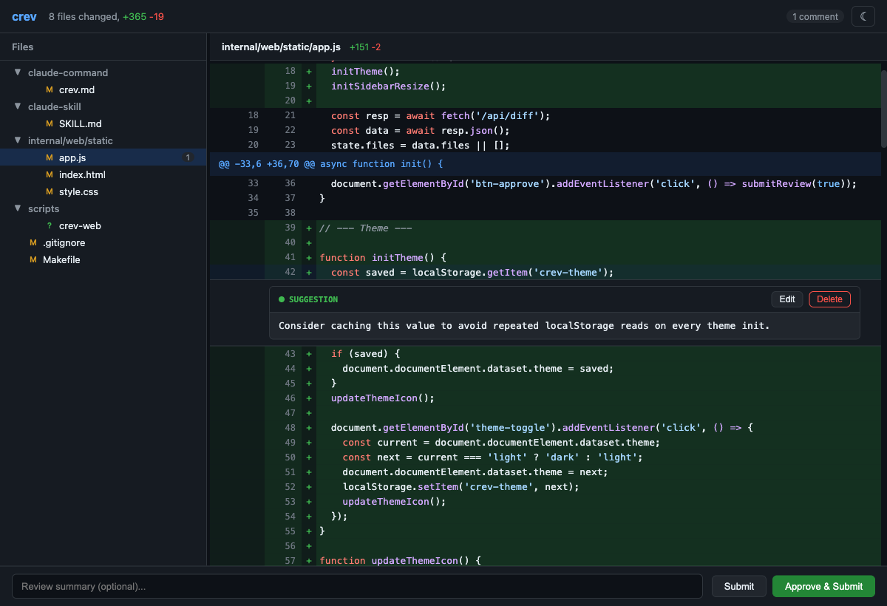

# crev

Interactive code review tool for git diffs. Browse changed files, add inline comments with severity levels, and submit structured JSON reviews.

Built to integrate with [Claude Code](https://docs.anthropic.com/en/docs/claude-code) as a skill — Claude makes changes, you review them in crev, and your feedback goes straight back.



## Install

```bash
make install
```

This builds the binary, installs it to `~/.claude/skills/review/`, and symlinks `crev` and `crev-web` into `~/.local/bin/`.

## Usage

### Web UI (default)

```bash
crev --web
```

Opens a browser-based review interface with syntax highlighting, dark/light themes, resizable sidebar, and inline commenting. Best for detailed reviews.

### Terminal UI

```bash
crev
```

Full TUI with vim-style keybindings (`j/k` navigation, `/` search). Runs in the terminal via [Bubble Tea](https://github.com/charmbracelet/bubbletea). Works over SSH and in tmux popups.

### Options

```
-o FILE    Save review JSON to file (default: stdout)
-d DIR     Review a different directory
-staged    Only review staged changes
-json      Raw JSON output (no formatting)
-web       Use browser-based UI
```

## Claude Code Integration

After `make install`, two integrations are available:

**Skill** (`/review`) — Claude automatically launches crev when you ask to review changes. Your comments come back as structured JSON that Claude can act on.

**Command** (`/crev`) — Explicitly launch a review session from Claude Code.

### Comment Severities

| Severity | Meaning |
|----------|---------|
| **Blocker** | Must fix before proceeding |
| **Concern** | Should address or justify |
| **Question** | Needs an answer |
| **Suggestion** | Consider implementing |
